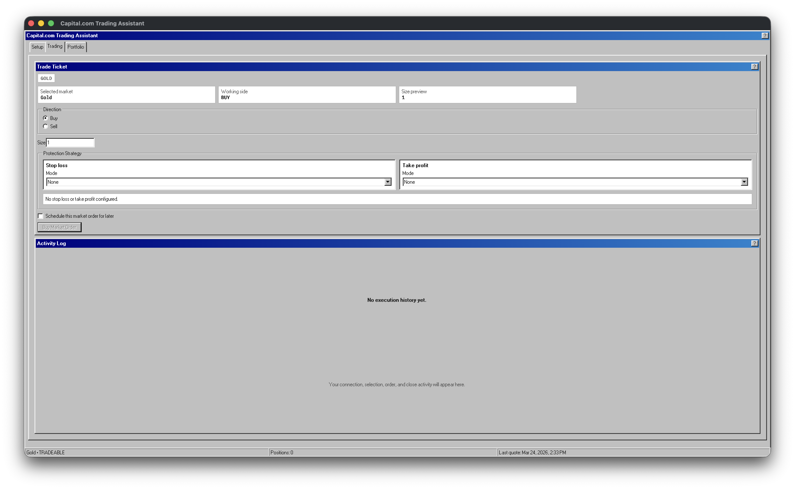
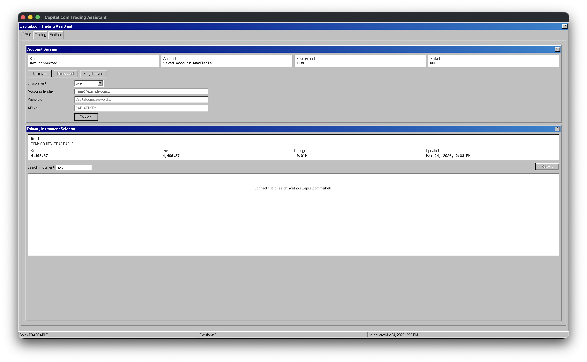
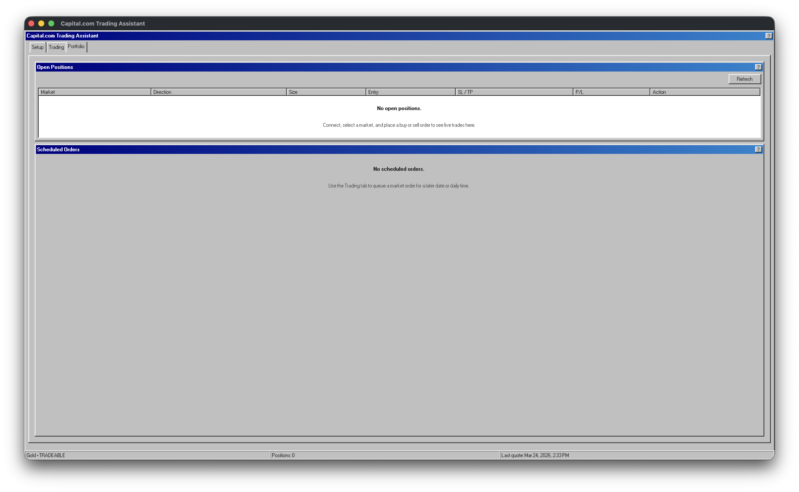

# Capital.com Trading Assistant

<p align="center">
  
</p>

<p align="center">
  A local desktop trading client for Capital.com.
</p>

<p align="center">
  Connect, pick a market, place an order, queue it for later, and manage protection without living in a browser tab.
</p>

<p align="center">
  
</p>

This project is a focused Electron workspace for Capital.com trading. The current workflow is Gold-first, the interface is intentionally minimal, and the app keeps authentication and broker calls in the Electron main process instead of pushing them into the renderer.

## Download

[Download the latest release](https://github.com/Svanny/capitalcombot/releases/latest)

- macOS: download the DMG that matches your Mac architecture (`arm64` for Apple Silicon, `x64` for Intel)
- Windows: download the NSIS `.exe` installer for `x64`
- Linux: download either the `AppImage` or the `.deb` package for `x64`

Release notes now call out which platforms are signed or unsigned. If signing credentials are unavailable for a given release, the binary is still published, but the operating system may show extra trust warnings during install.

## Three Tabs, One Job

`Setup` gets the account and primary market ready.

`Trading` handles immediate orders, delayed orders, and stop-loss or take-profit strategy inputs in one screen.

`Portfolio` is where open positions and scheduled jobs stay visible after the order is placed.

## What It Actually Does

- Capital.com demo and live login from a desktop app
- Primary instrument search and selection
- Immediate market buy and sell orders
- One-off and repeating scheduled market orders
- Stop-loss and take-profit strategy preview
- Position close, reverse, and protection update actions
- Local execution log and scheduled-order tracking
- macOS keychain-backed saved credentials when `keytar` is available

## Product Walkthrough

### Setup

<p align="center">
  
</p>

The setup tab handles connection state, environment selection, saved profile reuse, and the primary instrument picker. The app is optimized around Gold, but it can search other Capital.com instruments once connected.

### Trading

<p align="center">
  
</p>

The trading tab keeps the ticket compact: direction, size, protection strategy, optional scheduling, and the activity log all sit together so trade intent and execution history are visible in the same place.

### Portfolio

<p align="center">
  
</p>

The portfolio tab is the follow-through screen. It shows open positions, scheduled jobs, and the actions you need after the trade is live.

## Quick Start

### Requirements

- macOS for local development and DMG packaging
- Node.js 25+
- `pnpm`
- A Capital.com account with API access enabled
- Capital.com account identifier, API password, and API key

### Install

```bash
pnpm install
```

If an older install fails with `Electron failed to install correctly`, run:

```bash
pnpm approve-builds --all
pnpm install
```

### Run

```bash
pnpm dev
```

### Test

```bash
pnpm test
```

### Build

```bash
pnpm build
```

## Release Automation

GitHub Actions is the primary release path. Pushing a semantic version tag publishes installers to GitHub Releases for macOS, Windows, and Linux.

Maintainer steps:

1. Update `package.json` to the new version.
2. Commit and push the version bump.
3. Create and push a tag like `v0.1.1`.
4. Wait for the `release` GitHub Actions workflow to finish.
5. Check the GitHub Release page for uploaded installers and `SHA256SUMS`.

## Runtime Notes

- Scheduled orders execute only while the desktop app is running
- Secrets are stored in the macOS keychain when `keytar` is available
- If `keytar` is unavailable, credentials fall back to memory for the current session only
- Non-secret local UI state is persisted only when secure state-integrity storage is available

## Packaging

```bash
pnpm package:linux
pnpm package:win:native
pnpm package:mac
pnpm package:win
pnpm package:all
```

Release artifacts are written to `release/`.

- `pnpm package:linux` builds Linux `AppImage` and `.deb` artifacts on Linux
- `pnpm package:win:native` builds a Windows NSIS installer on Windows
- `pnpm package:win` keeps the Docker/Wine path for macOS or Linux maintainers cross-building Windows locally
- `pnpm package:mac` builds a DMG on macOS

Signed packaging is used automatically when the relevant credentials are present. Local-only unsigned macOS or Windows builds still require `ALLOW_UNSIGNED_PACKAGING=1`.

## Security Docs

- [Threat model](./docs/security/capitalcombot-threat-model.md)
- [Best practices report](./docs/security/security_best_practices_report.md)
- [Ownership sensitivity config](./docs/security/ownership-sensitive.csv)
- [Ownership outputs](./docs/security/ownership-map-out)

## Repository Layout

```text
src/main       Electron main process, IPC, trading, state, and security services
src/preload    Renderer-safe desktop API bridge
src/renderer   React app and UI
src/shared     Shared IPC contracts and types
docs/security  Audit artifacts
scripts        Packaging helpers
```

## License

Licensed under the Apache License, Version 2.0. See [LICENSE](./LICENSE).
