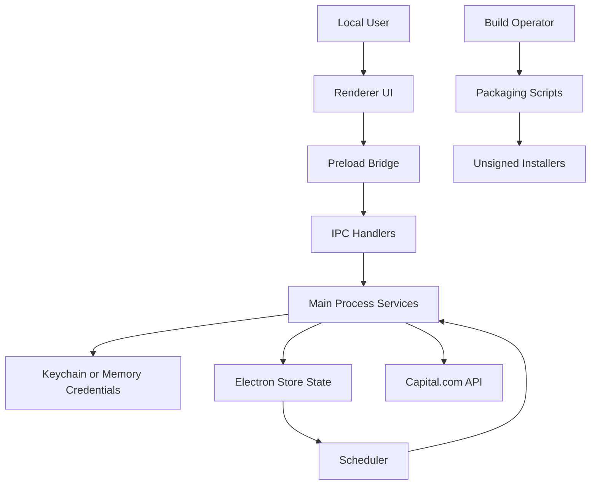

# Capitalcombot Threat Model

> Note: this document captures the audit baseline from March 27, 2026 before the follow-up remediation changes in the current working tree.

## Executive summary
`capitalcombot` is a local Electron desktop trading client that can authenticate to Capital.com, place immediate or scheduled market orders, and update position protection from a privileged Electron main process ([README.md:3-15](README.md), [src/main/index.ts:11-39](src/main/index.ts), [src/main/ipc.ts:61-97](src/main/ipc.ts)). The highest-risk themes are privilege-boundary failure between the renderer and the privileged main process, tampering with locally persisted trading state, and supply-chain/distribution tampering caused by unsigned installer output for a finance-sensitive desktop app ([src/main/index.ts:41-55](src/main/index.ts), [src/main/services/app-store.ts:72-100](src/main/services/app-store.ts), [electron-builder.yml:21-39](electron-builder.yml), [README.md:57-88](README.md)).

## Scope and assumptions
- In scope:
  - Electron runtime, including `src/main/index.ts`, `src/preload/index.ts`, `src/main/ipc.ts`, `src/main/capital/client.ts`, `src/main/services/*`, `src/shared/*`
  - Renderer-driven trading flows in `src/renderer/**`
  - Packaging and distribution config in `electron-builder.yml` and `scripts/package-*.sh`
- Out of scope:
  - Capital.com backend internals and Capital.com-side auth/session protections
  - OS- or firmware-level compromise beyond normal user-space assumptions
  - Infrastructure outside the repo, including network perimeter controls, notarization pipelines, or artifact-hosting protections not represented here
- Assumptions:
  - Intended usage is a personal/local desktop app on a mostly trusted machine.
  - Demo and live Capital.com environments are both realistic; severity is ranked by worst plausible live-trading impact.
  - The app is distributed as local unsigned builds today, not via a managed store or signed auto-update channel ([README.md:57-81](README.md), [electron-builder.yml:21-39](electron-builder.yml)).
  - Local users who can already fully control the host are not treated as a separate app-layer identity boundary, but local tampering still matters because persisted state can trigger live trades later.
- Open questions that could materially change ranking:
  - Whether future releases will be code signed/notarized.
  - Whether the renderer will ever load remote content outside current dev-only `ELECTRON_RENDERER_URL` usage ([src/main/index.ts:62-65](src/main/index.ts)).

## System model
### Primary components
- Renderer UI: React UI that captures credentials, market search, order tickets, schedules, and protection updates, then calls `window.capitalApi.*` ([src/renderer/src/App.tsx:342-417](src/renderer/src/App.tsx), [src/renderer/src/App.tsx:507-645](src/renderer/src/App.tsx)).
- Preload bridge: exposes a fixed `capitalApi` object backed by `ipcRenderer.invoke` into the renderer global namespace ([src/preload/index.ts:15-78](src/preload/index.ts)).
- Electron main process: creates the browser window, disables Chromium sandboxing for that window, restores scheduled jobs, registers IPC handlers, and instantiates the Capital client and stores ([src/main/index.ts:11-39](src/main/index.ts), [src/main/index.ts:41-89](src/main/index.ts)).
- IPC layer: maps renderer calls to privileged actions such as connect, trade placement, schedule creation/cancellation, quote fetches, and protection updates ([src/main/ipc.ts:61-97](src/main/ipc.ts), [src/main/ipc.ts:236-362](src/main/ipc.ts)).
- Capital API client: holds in-memory session tokens and credentials, authenticates to Capital.com demo/live endpoints, and performs market/order/position operations over HTTPS ([src/main/capital/client.ts:71-122](src/main/capital/client.ts), [src/main/capital/client.ts:389-499](src/main/capital/client.ts)).
- Local persistence:
  - Credentials: saved to macOS keychain through `keytar`, with in-memory-only fallback when `keytar` is unavailable ([src/main/services/credential-store.ts:33-90](src/main/services/credential-store.ts), [README.md:86-88](README.md)).
  - Non-secret state: `electron-store` persists selected market, schedules, execution log, and saved profile ([src/main/services/app-store.ts:11-17](src/main/services/app-store.ts), [src/main/services/app-store.ts:72-100](src/main/services/app-store.ts), [README.md:83-88](README.md)).
- Packaging: local DMG/NSIS output, unsigned and not notarized, with Windows packaging performed in Docker/Wine ([README.md:57-81](README.md), [electron-builder.yml:21-39](electron-builder.yml), [scripts/package-win-docker.sh:19-28](scripts/package-win-docker.sh)).

### Data flows and trust boundaries
- User -> Renderer UI
  - Data: Capital identifier, password, API key, market queries, order parameters, schedule times, protection inputs
  - Channel: local desktop UI events
  - Guarantees: renderer form validation exists for common fields and schedule formats ([src/renderer/src/lib/validation.ts:28-105](src/renderer/src/lib/validation.ts))
  - Validation: string trimming and basic field checks in renderer only; no independent schema enforcement is visible in the IPC layer ([src/renderer/src/lib/validation.ts:28-105](src/renderer/src/lib/validation.ts), [src/main/ipc.ts:61-97](src/main/ipc.ts))
- Renderer -> Preload bridge
  - Data: structured trading, auth, schedule, and protection requests
  - Channel: `window.capitalApi` methods exposed via `contextBridge`
  - Guarantees: fixed method surface, `contextIsolation: true`, `nodeIntegration: false` ([src/main/index.ts:50-55](src/main/index.ts), [src/preload/index.ts:43-78](src/preload/index.ts))
  - Validation: none in preload beyond error parsing; payloads are passed directly to IPC invoke ([src/preload/index.ts:15-20](src/preload/index.ts))
- Preload/Renderer -> Main process IPC
  - Data: credentials, order requests, protection configs, deal IDs, schedule IDs
  - Channel: Electron `ipcRenderer.invoke` / `ipcMain.handle`
  - Guarantees: channel names are fixed; no per-call authz or runtime schema validation is visible ([src/main/ipc.ts:61-97](src/main/ipc.ts))
  - Validation: main process relies on TypeScript types and downstream business logic; malformed or attacker-crafted payloads are not rejected at a central boundary ([src/main/ipc.ts:113-178](src/main/ipc.ts), [src/main/ipc.ts:236-362](src/main/ipc.ts))
- Main process -> Local credential store / local app state
  - Data: full Capital credentials in keychain or memory; saved profile, schedules, execution log, selected market in `electron-store`
  - Channel: local OS keychain APIs and filesystem-backed Electron store
  - Guarantees: credentials are intended to remain in main process and keychain-backed when available ([README.md:7](README.md), [src/main/services/credential-store.ts:33-90](src/main/services/credential-store.ts))
  - Validation: persisted schedules are shape-checked on read, but not integrity-protected ([src/main/services/app-store.ts:153-173](src/main/services/app-store.ts))
- Main process -> Capital.com API
  - Data: identifier/password/API key on session creation; session tokens on subsequent requests; market/order/protection data
  - Channel: HTTPS `fetch` to demo/live Capital.com API endpoints ([src/main/capital/client.ts:71-122](src/main/capital/client.ts), [src/main/capital/client.ts:389-449](src/main/capital/client.ts))
  - Guarantees: HTTPS via remote API URLs; session headers kept in main-process memory only
  - Validation: response status checked, limited response normalization, deal confirmations retried ([src/main/capital/client.ts:451-499](src/main/capital/client.ts))
- Persisted schedule state -> Scheduler execution
  - Data: order direction, size, market epic, run time, protection settings
  - Channel: `electron-store` -> scheduler restore -> timers -> order placement
  - Guarantees: only basic field validation before restore; execution still requires an active Capital session ([src/main/services/scheduler.ts:44-52](src/main/services/scheduler.ts), [src/main/services/scheduler.ts:99-142](src/main/services/scheduler.ts), [src/main/capital/client.ts:412-430](src/main/capital/client.ts))
  - Validation: schedule shape validation is shallow and does not authenticate the origin of persisted jobs ([src/main/services/app-store.ts:160-173](src/main/services/app-store.ts))
- Build operator -> Packaging scripts / output installers
  - Data: source tree, dependency graph, generated installer artifacts
  - Channel: local shell, Docker/Wine for Windows packaging
  - Guarantees: `pnpm install --frozen-lockfile` is used in the Windows packaging container ([scripts/package-win-docker.sh:19-28](scripts/package-win-docker.sh))
  - Validation: installers are intentionally unsigned and not notarized today ([README.md:81](README.md), [electron-builder.yml:26-29](electron-builder.yml))

#### Diagram

## Assets and security objectives
| Asset | Why it matters | Security objective (C/I/A) |
| --- | --- | --- |
| Capital credentials (identifier, password, API key) | Can initiate authenticated broker sessions and enable live trading | C, I |
| Session headers (`CST`, `X-SECURITY-TOKEN`) | Permit authenticated Capital API calls after login | C, I |
| Order intent and protection parameters | Unauthorized changes can place or alter live trades | I |
| Persisted schedules and execution log | Can trigger later trade execution or mislead operator activity review | I, A |
| Packaged installer artifacts | Tampered builds can exfiltrate credentials or silently place trades | I |
| Availability of main-process trading services | UI or automation failure can block or mis-time order execution | A |

## Attacker model
### Capabilities
- Can influence renderer input through local UI use, malicious pasted values, or a compromised renderer/web content path.
- Can tamper with local non-keychain app state if they obtain user-level filesystem access to the host.
- Can tamper with unsigned build artifacts or substitute a malicious installer if distribution is done through ad hoc channels.
- Can exploit business actions exposed by preload and IPC if the renderer trust boundary fails.

### Non-capabilities
- Does not inherently control Capital.com backend responses or Capital.com authentication systems.
- Is not assumed to have kernel- or firmware-level control of the host for baseline ranking.
- Cannot directly read full credentials from renderer state after successful connect because the password is cleared in the UI and credentials are meant to stay in the main process/keychain ([src/renderer/src/App.tsx:357-366](src/renderer/src/App.tsx), [README.md:7](README.md)).

## Entry points and attack surfaces
| Surface | How reached | Trust boundary | Notes | Evidence (repo path / symbol) |
| --- | --- | --- | --- | --- |
| Login form | User submits credentials in renderer | User -> Renderer -> IPC -> Main | Credentials cross into main process and are saved to keychain/memory | `src/renderer/src/App.tsx` `handleConnect`; `src/main/ipc.ts` `connect`; `src/main/services/credential-store.ts` |
| Saved-credentials login | Renderer invokes `connectSaved` | Renderer -> IPC -> Main -> Keychain | Lets any renderer code trigger reuse of saved credentials | `src/preload/index.ts:47-52`, `src/main/ipc.ts:146-156` |
| Market search/select | Renderer search box and selection | Renderer -> IPC -> Main -> Capital API | Mostly lower risk data fetch, but part of authenticated session surface | `src/main/ipc.ts:180-223`, `src/main/capital/client.ts:136-192` |
| Immediate market order | Order ticket submit | Renderer -> IPC -> Main -> Capital API | Integrity-critical live trading action | `src/renderer/src/App.tsx:507-545`, `src/main/ipc.ts:236-286`, `src/main/capital/client.ts:244-281` |
| Scheduled market order | Order ticket with schedule | Renderer -> IPC -> Main -> electron-store -> timers | Integrity-critical and persists across app sessions | `src/main/ipc.ts:248-258`, `src/main/services/scheduler.ts:58-79` |
| Protection preview/update | Protection form and update action | Renderer -> IPC -> Main -> Capital API | Can materially change live position risk | `src/main/ipc.ts:101-111`, `src/main/ipc.ts:319-349`, `src/main/services/protection.ts` |
| Scheduler restore/execute | App startup and timer firing | Persisted store -> Main -> Capital API | Local persisted state can later drive automatic trades | `src/main/index.ts:71-89`, `src/main/services/scheduler.ts:44-52`, `src/main/services/scheduler.ts:162-252` |
| Packaging scripts | Local build operator runs package commands | Build env -> output installers | Finance app installers are unsigned and not notarized | `README.md:57-81`, `electron-builder.yml:21-39`, `scripts/package-*.sh` |

## Top abuse paths
1. Attacker gains renderer-code execution -> calls `window.capitalApi.orders.openMarket` or `window.capitalApi.positions.updateProtection` -> main process accepts payload -> live Capital account receives unauthorized trade or risk change.
2. Attacker gains renderer-code execution -> calls `window.capitalApi.auth.connectSaved` -> app reuses stored credentials -> attacker then drives authenticated trading actions without re-entering secrets.
3. Attacker with local filesystem access alters persisted schedule state -> scheduler restores and arms tampered jobs on next launch -> later connected session executes unintended trade.
4. Attacker distributes a trojanized unsigned DMG/NSIS build -> user installs and authenticates -> malicious code captures credentials or issues broker actions from the privileged main process.
5. Malicious or malformed renderer payload reaches IPC boundary -> main-process logic executes with missing schema checks -> privileged action or app crash occurs before deeper business validation catches it.
6. Local tampering changes execution-log or schedule records in `electron-store` -> operator sees misleading state about what is queued or what already ran -> delayed detection of unauthorized or unintended trades.

## Threat model table
| Threat ID | Threat source | Prerequisites | Threat action | Impact | Impacted assets | Existing controls (evidence) | Gaps | Recommended mitigations | Detection ideas | Likelihood | Impact severity | Priority |
| --- | --- | --- | --- | --- | --- | --- | --- | --- | --- | --- | --- | --- |
| TM-001 | Compromised renderer or malicious content in renderer context | Renderer-code execution or any future remote-content/XSS path | Use exposed preload methods to invoke privileged IPC trading/auth actions | Unauthorized live trades, protection changes, or session reuse | Credentials, session, order intent | `contextIsolation: true` and `nodeIntegration: false` are enabled; preload exposes a fixed API surface ([src/main/index.ts:50-55](src/main/index.ts), [src/preload/index.ts:43-78](src/preload/index.ts)) | Chromium sandbox is disabled and there is no independent authz or schema gate on IPC handlers ([src/main/index.ts:54](src/main/index.ts), [src/main/ipc.ts:61-97](src/main/ipc.ts)) | Enable Electron sandbox, minimize exposed preload surface, add runtime validation and explicit allowlist checks at IPC boundary, treat renderer as untrusted for privileged actions | Log and alert on unexpected trade calls, schedule creation, and `connectSaved` usage; add IPC audit logging with action + origin metadata | Medium | High | high |
| TM-002 | Local user-space attacker or malware with filesystem access | Access to the app’s persisted state files | Modify queued schedules or execution state so restored jobs execute attacker-chosen trades later | Unintended order placement or misleading operator view of queued actions | Order intent, persisted schedules, execution log | Schedules are shape-validated and jobs only execute while app is running; live execution still needs a connected session ([src/main/services/app-store.ts:153-173](src/main/services/app-store.ts), [src/main/services/scheduler.ts:99-142](src/main/services/scheduler.ts), [README.md:85-88](README.md)) | Persisted state is not integrity-protected, and restored jobs are automatically armed after shallow validation ([src/main/services/app-store.ts:72-100](src/main/services/app-store.ts), [src/main/services/scheduler.ts:44-52](src/main/services/scheduler.ts), [src/main/services/scheduler.ts:144-150](src/main/services/scheduler.ts)) | Add integrity protection for persisted schedules, re-validate all nested fields in main process, require explicit user confirmation for restored pending jobs before live execution | Log schedule restore events, checksum failures, and any job mutated after initial creation; show high-visibility banner for restored schedules | Medium | High | high |
| TM-003 | Malicious distributor, build host compromise, or artifact substitution | User installs an unsigned build from an untrusted or weakly trusted channel | Replace app binary or installer with malicious version that captures secrets or issues trades | Full compromise of credentials and trading integrity | Installer artifacts, credentials, order flow | Packaging process is documented and reproducible locally; Windows packaging uses `--frozen-lockfile` inside builder container ([scripts/package-win-docker.sh:19-28](scripts/package-win-docker.sh)) | macOS identity is null, DMG signing is disabled, README states builds are unsigned and not notarized ([electron-builder.yml:21-29](electron-builder.yml), [README.md:57-81](README.md)) | Code sign and notarize release artifacts, publish checksums/signatures, separate trusted release pipeline from local dev packaging | Track artifact hashes, release provenance, and download locations; treat unsigned release usage as a security event for live trading | Medium | High | high |
| TM-004 | Malicious or buggy renderer payload | Ability to invoke exposed preload methods | Send malformed or out-of-policy IPC payloads that the main process trusts as typed objects | App crash, inconsistent state, or privileged action with unexpected parameters | Main-process availability, order integrity | Renderer-side validation exists for normal UI flows, and downstream business logic rejects some invalid values ([src/renderer/src/lib/validation.ts:28-105](src/renderer/src/lib/validation.ts), [src/main/services/protection.ts:18-190](src/main/services/protection.ts), [src/main/services/scheduler.ts:273-312](src/main/services/scheduler.ts)) | No centralized runtime schemas or per-channel validation at `ipcMain.handle` boundary ([src/main/ipc.ts:61-97](src/main/ipc.ts), [src/main/ipc.ts:236-362](src/main/ipc.ts)) | Add zod/io-ts style schemas or equivalent runtime validation for every IPC channel; normalize and reject unknown fields centrally | Count and surface rejected IPC payloads, channel-specific exception rates, and unexpected validation failures | Medium | Medium | medium |
| TM-005 | Dependency supply-chain attacker or accidental upstream regression | New install, lockfile refresh, or rebuild with changed upstream package releases | Introduce malicious or breaking dependency into privileged Electron runtime or packaging toolchain | Credential theft, privilege-boundary failure, or release compromise | Build pipeline, runtime dependencies | Lockfile exists and Windows packaging uses `pnpm install --frozen-lockfile` ([pnpm-lock.yaml](pnpm-lock.yaml), [scripts/package-win-docker.sh:28](scripts/package-win-docker.sh)) | `package.json` declares runtime and build dependencies as `latest`, reducing version review discipline ([package.json:20-42](package.json)) | Pin reviewed semver ranges or exact versions, keep lockfile under deliberate review, add dependency-audit/release-review policy for finance-sensitive packages | Alert on lockfile drift, review dependency diffs in PRs, and record package provenance for release builds | Medium | Medium | medium |

## Criticality calibration
- `critical` for this repo:
  - Any path that enables silent live-trade placement without user intent
  - Credential or session-token theft that gives direct broker access
  - Signed/official release-channel compromise once release signing exists
- `high` for this repo:
  - Renderer-to-main privilege escalation that can drive authenticated trading
  - Persisted schedule tampering that can later place live orders
  - Unsigned installer tampering in current ad hoc distribution model
- `medium` for this repo:
  - IPC payload abuse that crashes the app or causes inconsistent trading state
  - Dependency drift that weakens supply-chain review but still depends on lockfile or install-path conditions
  - Local log/state tampering that misleads the operator without directly exposing broker credentials
- `low` for this repo:
  - Low-sensitivity UI metadata exposure such as selected market or non-secret status messages
  - Development-only issues that require `ELECTRON_RENDERER_URL` or local dev tooling and do not affect shipped builds

Examples by level:
- `critical`: silent live order execution from a compromised release build; theft of reusable Capital session headers.
- `high`: compromised renderer invoking `connectSaved` then placing orders; tampered restored schedule firing a live order.
- `medium`: malformed IPC payload causing repeated scheduler failures; dependency update introducing weakened Electron defaults before release review.
- `low`: exposure of selected market or schedule count in local UI state; missing hardening for purely dev-only hot reload usage.

## Focus paths for security review
| Path | Why it matters | Related Threat IDs |
| --- | --- | --- |
| `src/main/index.ts` | Defines Electron window hardening posture and startup restore order | TM-001, TM-002 |
| `src/preload/index.ts` | Exposes the privileged renderer API surface | TM-001, TM-004 |
| `src/main/ipc.ts` | Main-process trust boundary for all auth, trading, and scheduling actions | TM-001, TM-004 |
| `src/main/capital/client.ts` | Holds session tokens and performs live broker actions | TM-001, TM-003 |
| `src/main/services/credential-store.ts` | Controls credential persistence and fallback behavior | TM-001, TM-003 |
| `src/main/services/app-store.ts` | Persists integrity-critical schedule/log/profile state | TM-002 |
| `src/main/services/scheduler.ts` | Restores, arms, and executes persisted trade schedules | TM-002, TM-004 |
| `electron-builder.yml` | Captures unsigned packaging defaults | TM-003 |
| `scripts/package-win-docker.sh` | Build chain for Windows release artifacts | TM-003, TM-005 |
| `package.json` | Shows dependency versioning strategy and build/runtime trust base | TM-005 |
